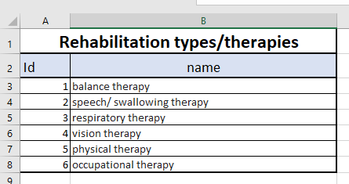
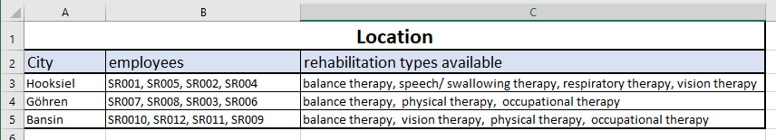
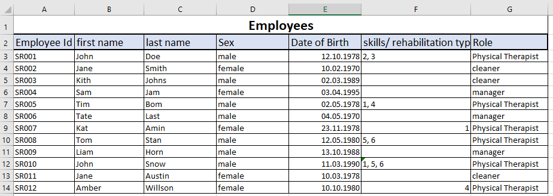
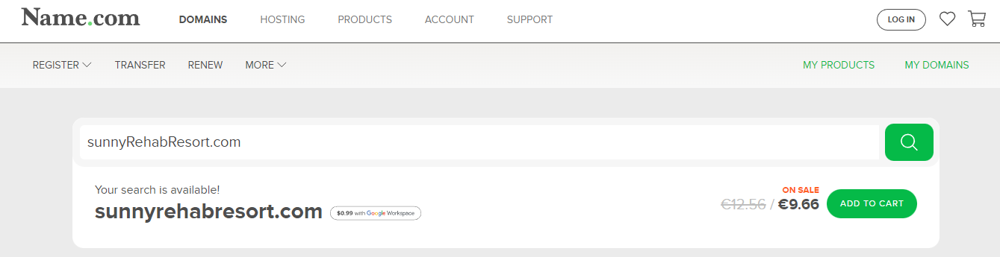
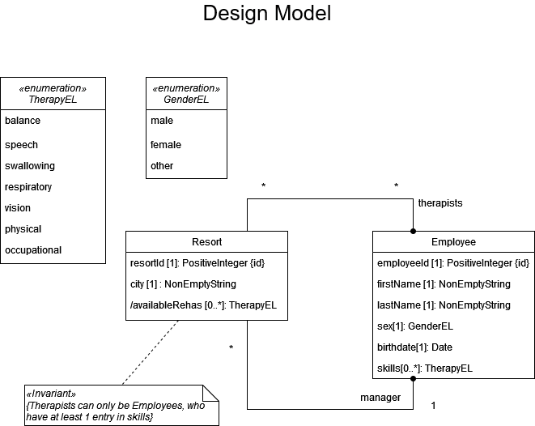
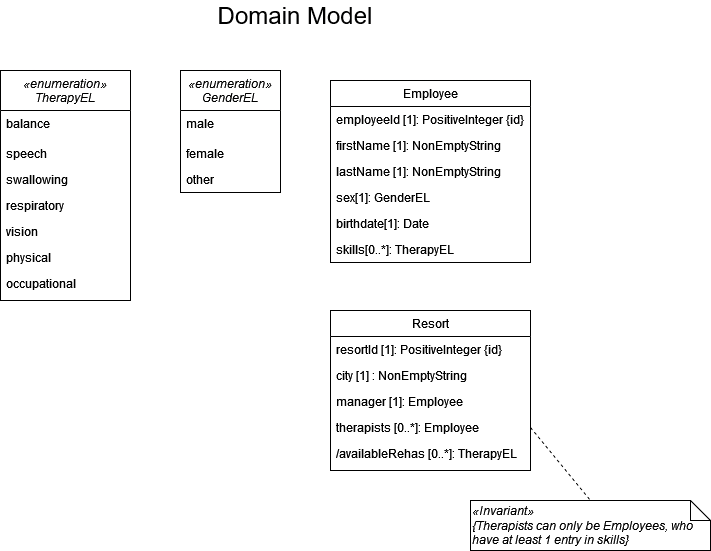

# Sunny rehabilitation Resort 
# Business description 
My name is Ivan Glad and I’m the owner of the „Sunny rehabilitation Resort”. We are a small company that has under 100 employees. As the name of our company states, we try to combine rehabilitation with holidays. Therefore we use the word „resort“ instead of center. Our target demographic is people above the age of 50, however, everyone is welcome to book a stay at our center. We are currently in possession of 4 different locations but will be looking to expand in the future as our company will grow. These places are small but we pride ourselves on the number of types of rehabilitation that we offer and our skillful employees. Since our resorts are placed in the beautiful: 1. Hooksiel 2. Göhren 3. Bansin. Our customers can, not only restore, improve or maintain their mobility, independence, and physical health but also use the time spent at our resort as a vacation to restore their inner peace and gain more energy for their everyday life. Each center has a different offer of rehabilitation based on the crew of workers stationed there, so before booking make sure to contact our staff and make sure that the location of your choosing has everything that you need.

# Application
# Why do we need the app
We are in need ofan application for our „Sunny rehabilitation Resort“. We have noticed thatmanaging on the go seems quite impossible for us. Since we aim to grow ourcompany, we attend many events to promote our resort. However gaining our 2ndand 3rd location has caused problems when viewing the different rehabilitationtypes, as well as our offers at different locations. In the past, we have kept everything in a paper form but with multiple resorts and different sets ofemployees it has started to be too time-consuming and it is not easy to keep everycenter at the same level based on their available information. Therefore we askyou to develop an app for us that would help us manage our locations, workers,and rehabilitation offers. We want our employees to be able to access that information at any point and at any location just by using it. The goal is so to have 3 databases:  one for locations, one for employees, and one for the rehabilitation types that we offer. Our employees should be able to view the information about any location or rehabilitation offers to be able then to provide the client with up to date information. Our managers should be able to hire new employees, to view the details of the ones that we have to the be able either to send them on courses in order to gain more skills and expand our offer but also to move them between resorts. 

# currently available Data: 

To provide you as the developer with as much information as possible I have created an Excel File with some data. I have listed a few rehabilitation types, all our locations, and a few employees. To protect their privacy I have swich their name and their data births. The sample data is also a lot smaller since the number of our employees currently stands at 42, but since little information will have to be changed anyway and since we are not sure how long development of this app can take it is best that the true data will be added as the last step by our employees.
Here I provide you with 3 Screenshots from the excel file:

# The name and the domain of the app

We have used this page https://www.name.com/domain/search to check if the name of our domain would be available and here you can see that 
the "sunnyRehabResort.com is not yet taken. We want our app to have the same name as the one listed on the picture.

# Tasks that this app shoul allow us to do:

The goal for this app would be to allow our workers to:
-	View the location information: city, workers assigned to this location, rehabilitation types available at this resort. 
-	add a new location when our company will grow
-	assign a new crew to a location or add or remove a single employee from the cast therefore also change the rehabilitation types at the resort accordingly.
-	View the list of rehabilitation types that we offer: names of each procedure, next to each name a list of employees that can do them
-	Add new rehabilitation types to the database
-	Remove rehabilitation types from the database 
-	Add a new employee to the employee database: Employee Id, legal name, set of skills = rehabilitation types that they support.
-	Update an existing employee data in case they acquire a new set of skills or change their name
-	Remove an employee from the database if needed
-	View the list of employess 

As the last note, I would like to state that we are a company with little to no background in the IT department, tehrefore if you will find yourself wanting to add or remove something or suggest a different approach we are very happy to listen to your ideas. 

# Developer Contribution:
# Models:

